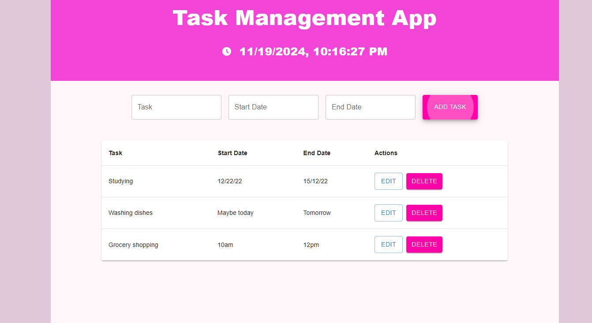

# Task Management App

## Introduction

This app is a work in progress which initially created for a tutorial published in [Medium](https://medium.com/@SevdaSevinu/build-a-task-management-app-with-react-typescript-and-material-ui-frontend-a-beginners-guide-bb4df98b1223).

### App Functionality

- Users can Add, Edit, Save and delete tasks.
- Tasks are displayed in a list.
- Showing current local date and time

## Install

Please ensure you have node and npm installed in your system. Fork the project and create repository in your computer. Open the folder in your code editor and run `npm start` .

## Follow me

[Medium](https://medium.com/@SevdaSevinu)

[Github](https://github.com/Sevicode)

[LinkedIn](https://www.linkedin.com/in/sevda-amini-phd-ab770743/)

[X](https://medium.com/r/?url=https%3A%2F%2Fx.com%2FSevdaSevinu)
